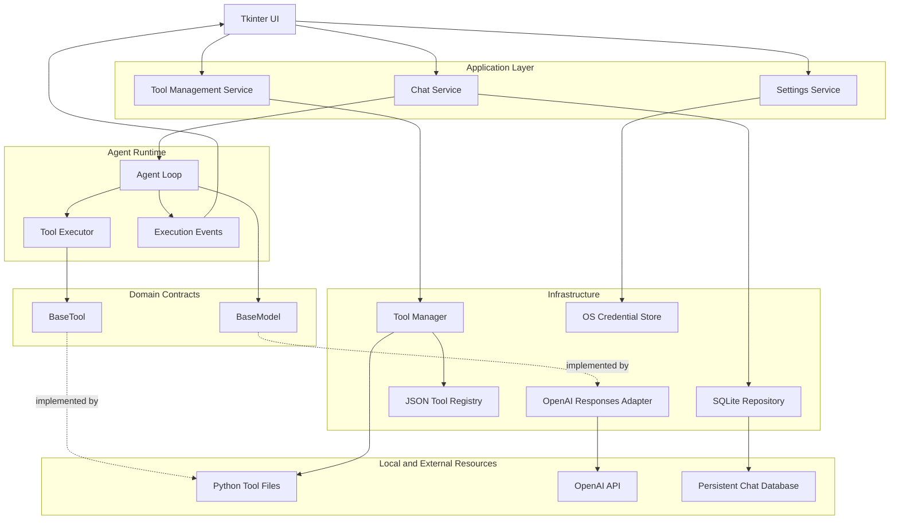

```mermaid
flowchart TB
    UI["Tkinter UI"]

    subgraph APP["Application Layer"]
        Chat["Chat Service"]
        Settings["Settings Service"]
        ToolManagement["Tool Management Service"]
    end

    subgraph RUNTIME["Agent Runtime"]
        Agent["Agent Loop"]
        Executor["Tool Executor"]
        Events["Execution Events"]
    end

    subgraph DOMAIN["Domain Contracts"]
        ModelABC["BaseModel"]
        ToolABC["BaseTool"]
    end

    subgraph INFRA["Infrastructure"]
        OpenAI["OpenAI Responses Adapter"]
        ToolManager["Tool Manager"]
        Registry["JSON Tool Registry"]
        Database["SQLite Repository"]
        KeyStore["OS Credential Store"]
    end

    subgraph EXTERNAL["Local and External Resources"]
        Tools["Python Tool Files"]
        API["OpenAI API"]
        ChatDB["Persistent Chat Database"]
    end

    UI --> Chat
    UI --> Settings
    UI --> ToolManagement

    Chat --> Agent
    Agent --> ModelABC
    Agent --> Executor
    Executor --> ToolABC
    Agent --> Events
    Events --> UI

    ModelABC -.implemented by.-> OpenAI
    OpenAI --> API

    ToolABC -.implemented by.-> Tools
    ToolManagement --> ToolManager
    ToolManager --> Registry
    ToolManager --> Tools

    Chat --> Database
    Database --> ChatDB
    Settings --> KeyStore
```